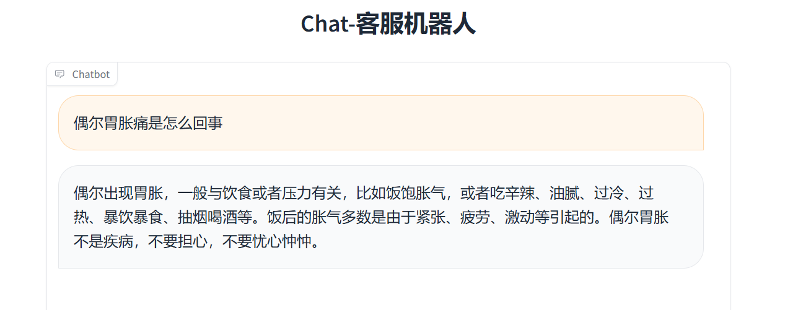

# Chat-medical

**Chat-medical** 是基于ChatGLM-6B基座进行LORA微调和推理检索增强（RAG）的医疗对话系统，代码主要来自https://github.com/KMnO4-zx/huanhuan-chat

**环境**  

python==3.12.3  
torch==2.3.0+cu121  
llama-index==0.10.29  

**获取基座模型** 

从 https://huggingface.co/THUDM/chatglm2-6b 下载基座模型到data/model/base  

**下载数据集** 

cd data  
python data.py  

**LORA微调**  

cd fine_tune/lora  
./train.medical.sh  

**合并LORA旁路到基座**  

python merge.py --adapter_model_path 'data/adapt'--merged_model_save_path 'merged_model'  

**推理**  

cd run  
./run_gui.sh  
本地浏览器访问 localhost:6006 即可开始聊天

